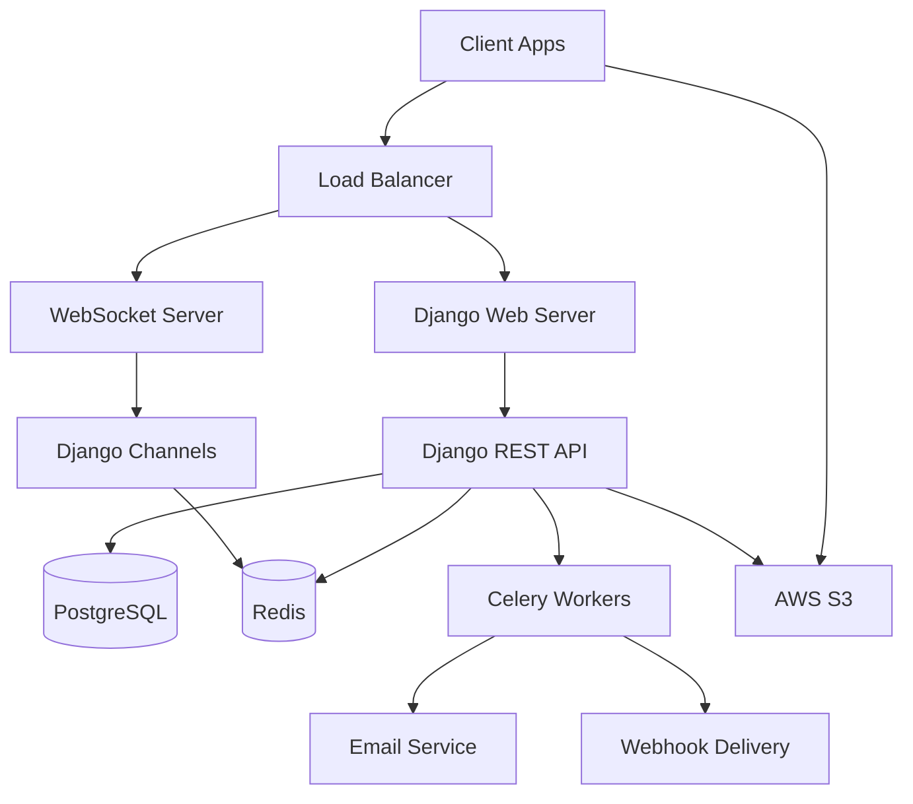

# 🚀 ChatBoard - Enterprise-Grade Real-time Chat Platform

<div align="center">


**Production-ready real-time team chat backend with enterprise features**

[🚀 Live Demo](#-live-demo) • [📚 API Documentation](#-api-documentation) • [🛠️ Features](#-features) • [⚡ Quick Start](#-quick-start)

</div>

---

## ✨ Features

### 🔐 **Authentication & Security**
- **JWT Authentication** with refresh tokens (6-day access, 7-day refresh)
- **Custom User Model** with email-based login
- **Role-Based Access Control** (RBAC) with organization-scoped permissions
- **WebSocket Authentication** with JWT token validation
- **Rate Limiting** (100 requests/minute per user)

### 🏢 **Multi-Tenant Organizations**
- **Organization Management** with admin/manager/member roles
- **Invite System** with secure token-based invitations
- **Role Management** with granular permissions
- **Organization-scoped** data isolation

### 💬 **Real-time Messaging**
- **WebSocket Integration** with Django Channels + Redis
- **Room-based Chat** with group messaging with access level controls
- **Auto-Join Logic** - New org members automatically join PUBLIC and MANAGER_ONLY rooms
- **Direct Messages** (DMs) support
- **Typing Indicators** and presence awareness
- **Message Pagination** with cursor-based pagination
- **Unread Counts** and read receipts

### 📁 **File Management**
- **Flexible Storage**: AWS S3 or local storage (configurable, defaults to local for FREE)
- **Presigned Upload URLs** for AWS S3 integration
- **Direct Upload** for local storage
- **File Type Validation** and size limits (100MB max)
- **Automatic Cleanup** with 30-day expiration
- **Secure File Access** with signed URLs

### 🔔 **Notifications & Webhooks**
- **Background Job Processing** with Celery + Redis
- **Email Notifications** for offline users
- **Webhook System** with HMAC signature verification
- **Retry Logic** with exponential backoff
- **Outbox Pattern** for reliable delivery

### 📊 **Monitoring & Observability**
- **Health Check Endpoints** (`/health/live`, `/health/ready`)
- **Structured JSON Logging** with request tracing
- **Performance Metrics** and monitoring hooks
- **Database Query Optimization** with proper indexing

### 🚀 **Production Ready**
- **Docker Containerization** with multi-stage builds
- **Docker Compose** for local development
- **Database Migrations** with proper versioning
- **Static File Handling** with CDN support
- **Environment Configuration** with `.env` support

---

## 🏗️ Architecture



### **Technology Stack**
- **Backend**: Django 5.0 + Django REST Framework
- **Real-time**: Django Channels + Redis Channel Layer
- **Database**: PostgreSQL 15 with optimized indexes
- **Cache**: Redis for caching and session storage
- **Background Jobs**: Celery + Redis broker
- **File Storage**: AWS S3 with presigned URLs
- **Authentication**: JWT with SimpleJWT
- **Documentation**: OpenAPI/Swagger with drf-spectacular
- **Containerization**: Docker + Docker Compose

---

## 🚀 Live Demo

### **API Documentation**
- **Swagger UI**: `https://your-domain.com/api/docs/`
- **OpenAPI Schema**: `https://your-domain.com/api/schema/`

### **Health Checks**
- **Liveness**: `https://your-domain.com/health/live`
- **Readiness**: `https://your-domain.com/health/ready`

### **WebSocket Connection**
```javascript
const ws = new WebSocket('wss://your-domain.com/ws/rooms/1/?token=YOUR_JWT_TOKEN');
```

---

## ⚡ Quick Start

### **Prerequisites**
- Python 3.11+
- Docker & Docker Compose
- PostgreSQL 15+
- Redis 7+

### **1. Clone & Setup**
```bash
git clone https://github.com/yourusername/chatboard.git
cd chatboard
```

### **2. Environment Configuration**
```bash
cp .env.example .env
# Edit .env with your configuration
```

### **3. Docker Development**
```bash
# Start all services
docker-compose up -d

# Run migrations
docker-compose exec web python manage.py migrate

# Create superuser
docker-compose exec web python manage.py createsuperuser

# View logs
docker-compose logs -f web
```

### **4. Local Development**
```bash
# Create virtual environment
python -m venv venv
source venv/bin/activate  # On Windows: venv\Scripts\activate

# Install dependencies
pip install -r requirements.txt

# Setup database
python manage.py migrate
python manage.py createsuperuser

# Start development server
python manage.py runserver
```

---

## 📚 API Documentation

### **Authentication Endpoints**
```http
POST /auth/register/          # User registration
POST /auth/token/             # Login (get JWT tokens)
POST /auth/token/refresh/     # Refresh access token
GET  /auth/me/                # Get current user profile
PATCH /auth/me/               # Update user profile
GET  /auth/me/unread-counts/  # Get unread message counts
```

### **Organization Endpoints**
```http
GET    /api/orgs/                    # List user's organizations
POST   /api/orgs/                    # Create organization
GET    /api/orgs/{id}/members/       # List organization members
POST   /api/orgs/{id}/invite/        # Invite user to organization
POST   /api/orgs/accept-invite/      # Accept organization invitation
POST   /api/orgs/{id}/members/{user_id}/role/  # Change member role
```

### **Room Endpoints**
```http
GET    /api/rooms/                   # List user's rooms
POST   /api/rooms/                   # Create room
GET    /api/rooms/{id}/members/      # List room members
POST   /api/rooms/{id}/read/{msg_id}/ # Mark messages as read
```

### **Message Endpoints**
```http
GET  /api/rooms/{id}/messages/      # List room messages (paginated)
POST /api/rooms/{id}/messages/      # Send message
```

### **File Upload Endpoints**
```http
POST /api/uploads/presign/           # Get presigned upload URL
GET  /api/uploads/my-uploads/        # List user's uploaded files
```

### **Webhook Endpoints**
```http
GET    /api/webhooks/                # List organization webhooks
POST   /api/webhooks/                # Create webhook
GET    /api/webhooks/{id}/events/    # List webhook delivery events
POST   /api/webhooks/{id}/test/      # Send test webhook
```

---

## 🔧 Configuration

### **Environment Variables**
```bash
# Django Settings
DJANGO_SECRET_KEY=your-secret-key
DJANGO_DEBUG=0
DJANGO_ALLOWED_HOSTS=your-domain.com

# Database
POSTGRES_DB=chatboard
POSTGRES_USER=chat
POSTGRES_PASSWORD=your-password
POSTGRES_HOST=localhost
POSTGRES_PORT=5432

# Redis
REDIS_URL=redis://localhost:6379/0
CELERY_BROKER_URL=redis://localhost:6379/1
CELERY_RESULT_BACKEND=redis://localhost:6379/2

# AWS S3
AWS_ACCESS_KEY_ID=your-access-key
AWS_SECRET_ACCESS_KEY=your-secret-key
AWS_STORAGE_BUCKET_NAME=your-bucket-name
AWS_S3_REGION_NAME=us-east-1

# Email (for notifications)
EMAIL_HOST=smtp.gmail.com
EMAIL_PORT=587
EMAIL_USE_TLS=True
EMAIL_HOST_USER=your-email@gmail.com
EMAIL_HOST_PASSWORD=your-app-password
```

---

## 🧪 Testing

### **Run Tests**
```bash
# Run all tests
pytest

# Run with coverage
pytest --cov=. --cov-report=html

# Run specific test file
pytest tests/test_api.py

# Run with verbose output
pytest -v
```

### **Test Coverage**
- **Authentication**: User registration, login, token refresh
- **Organizations**: CRUD operations, member management, invitations
- **Rooms**: Creation, membership, permissions
- **Messages**: Sending, receiving, pagination
- **WebSockets**: Connection, authentication, message broadcasting
- **File Uploads**: Presigned URLs, validation, cleanup
- **Webhooks**: Creation, delivery, retry logic

---

## 🚀 Deployment

### **Production Deployment**
```bash
# Build production image
docker build -t chatboard:latest .

# Run with production settings
docker run -d \
  --name chatboard \
  -p 8000:8000 \
  -e DJANGO_DEBUG=0 \
  -e DJANGO_SECRET_KEY=your-secret-key \
  chatboard:latest
```

### **Cloud Deployment**
- **AWS**: ECS, EKS, or EC2 with RDS and ElastiCache
- **Google Cloud**: Cloud Run with Cloud SQL and Memorystore
- **Azure**: Container Instances with Azure Database
- **Railway**: One-click deployment with managed services
- **Render**: Automatic deployments with managed PostgreSQL

---

## 📈 Performance & Scaling

### **Optimizations**
- **Database Indexing**: Optimized queries with proper indexes
- **Connection Pooling**: Efficient database connections
- **Redis Caching**: Session and data caching
- **CDN Integration**: Static file delivery
- **Background Processing**: Async task handling

### **Monitoring**
- **Health Checks**: Application and dependency monitoring
- **Logging**: Structured JSON logs with request tracing
- **Metrics**: Performance and usage metrics
- **Alerts**: Automated monitoring and alerting

---

## 🤝 Contributing

1. **Fork the repository**
2. **Create a feature branch**: `git checkout -b feature/amazing-feature`
3. **Commit changes**: `git commit -m 'Add amazing feature'`
4. **Push to branch**: `git push origin feature/amazing-feature`
5. **Open a Pull Request**

---

## 📄 License

This project is licensed under the MIT License - see the [LICENSE](LICENSE) file for details.

---

## 🙏 Acknowledgments

- **Django Community** for the amazing framework
- **Django REST Framework** for excellent API tools
- **Django Channels** for WebSocket support
- **Celery** for background task processing
- **Redis** for caching and message brokering

---

<div align="center">

**Built with ❤️ for modern team collaboration**

[⭐ Star this repo](https://github.com/yourusername/chatboard) • [🐛 Report Bug](https://github.com/yourusername/chatboard/issues) • [💡 Request Feature](https://github.com/yourusername/chatboard/issues)

</div>
